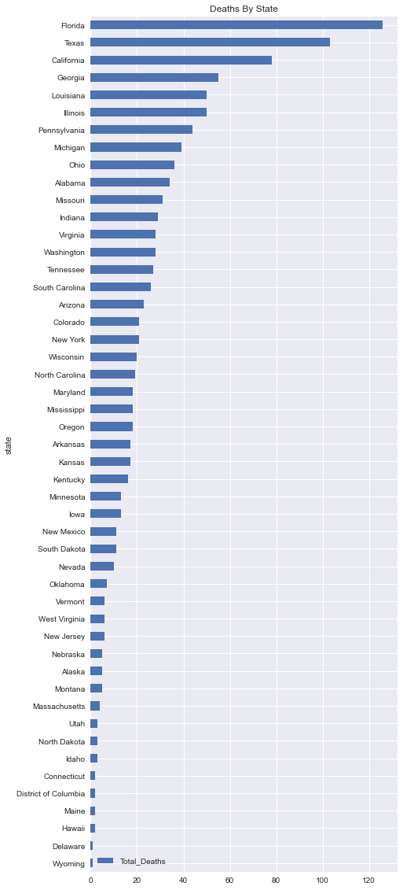
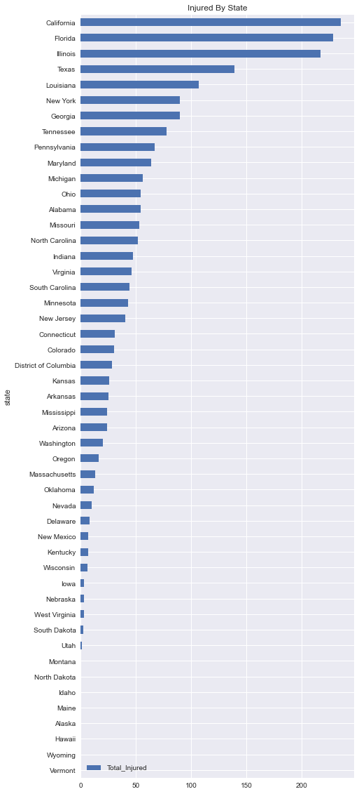
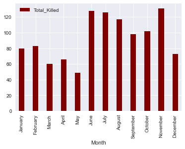
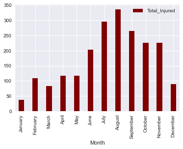

# Gun Violence ETL

# Project Scope

* For the scope of this project we were asked to extract, transform, and load several data sets on gun related violence into an SQL database, then perform analysis on the data. In order to complete this project we used the following:
    - Python
    - Jupyter Notebook
    - Pandas
    - Sqlalchemy
    - Matplotlib
    
* The resources for this data are located here:
  [Gun Violence Database](https://www.kaggle.com/gunviolencearchive/gun-violence-database)

# Process
1. ETL

After the data was retrieved from the source it was then loaded into multiple pandas dataframes in our etl.ipynb jupyter notebook. We then removed the columns that were unnecessary for our purposes. We then created tables to store this data in postgres SQL using the schema we created that can be seen in the schema.sql file in this project. The data was then loaded into the database using sqlsalchemy to create the connection and then load it. 

2. Analysis

Once loaded into the SQL database another notebook called analysis.ipynb was used to perform the analysis. We used sqlalchemy to perform querys of the database and create two tables using pandas to compare the total deaths of gun violence due to officer involved shootings, mass shootings, and accidents, and we did the same to compare all of those that caused injuries as well. We then created two horizonal bar graphs using sqlalchemy, pandas, and matplotlib that compared overall gun injuries and overall gun killings by state. Last, We created line graphs using all the previous libararies to compare total gun injuries and total gun deaths per month throughout the year.

# Results

|Officer Kills|Mass Shooting Kills|Accidental Deaths|
|-------------|-------------------|-----------------|
|26           |581                |506              |

|Officer Injured|Mass Shooting Injuried|Accidental Injured|
|---------------|----------------------|------------------|
|59             |2029                  |17                |

In the above tables it can be determined from the data that in both the injured and killed categories Mass shootings has the high number of incidents. What is interesting however is that gun accident seem to result in a higher number of deaths than injuries.

------------------------------------------------------------------------------------------------------------------------------------------------------------------------------------

In the above graph we can see that Florida, Texas, California, Georgia, and Louisiana. All these states have varying gun laws. according to this article [Strictest gun laws by state](https://worldpopulationreview.com/state-rankings/strictest-gun-laws-by-state) California, New Jersey, Connecticut, New York, and Hawaii have the stricted gun laws in the US where as Kentucky, Missouri, Idaho, Wyoming, and Missippi have the weakest.

-------------------------------------------------------------------------------------------------------------------------------------------------------------------------------------

This graph appears very similar to the total deaths graph however we see that Illinois now joins the top five. What is interesting is both these charts seem to contradict this article [States with weak gun laws suffer from the most gun violence](https://www.judiciary.senate.gov/press/dem/releases/states-with-weak-gun-laws-suffer-from-more-gun-violence#:~:text=A%20study%20by%20the%20Center,Connecticut%2C%20New%20Jersey%2C%20Maryland%2C)

--------------------------------------------------------------------------------------------------------------------------------------------------------------------------------------

In this graph we can see no real clear pattern or trend in relation of month to gun deaths.

--------------------------------------------------------------------------------------------------------------------------------------------------------------------------------------

In this graph it appears that gun injuries trend higher during the summer months and then seem to trend back down as it gets colder.

# Limitations

The limitations of this dataset is that is collected from media, law enforcement, government and commercial sources which are not neccessarily completely reliable. It is also collected over a time span of only 3 years (2014-2016) therefore is not up to date. 
